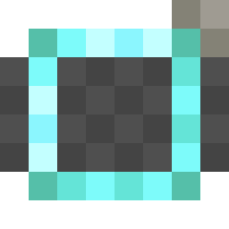

  

**This mod adds new custom gauges to create mod, like the factory gauge, but with different functions**

It also adds a custom API which allows mod developers to make their own gauges
(See more in the [Wiki](https://github.com/LIUKRAST/CreateExtraGauges/wiki)).

##  Logic Gauge
> The logic gauge allows transferring redstone data through their connections.
> Instead of having an item filter like the factory gauge,
> it lets you select between many Logic Gates (OR, AND, NAND, NOR, XOR, XNOR)
> and will use these gates to manage the inputs/outputs. 
> `Example: You have two redstone signals coming into the gauge, and your logic gate is set to "AND",
> it will only output redstone if ALL the inputs are on.`

##  Integer Gauge
> The integer gauge transfers integer (numerical) data through their connections.
> Instead of a logic gate, it will have some mathematical operation gates (+, -, *),
> and will apply those operations with the inputs.
> If connected to **Factory Gauges**,
> they will send the item amount of that type in the linked storage all the way to the integer gauge. 
> `Example: You have to factory gauge inputs (one for diamonds and one for emeralds), and you have 3 diamonds and 2 emeralds in your storage.
> You can use the integer gauge to sum, subtract or multiply these two numbers to get an integer output (for example 3 + 2 = 5). This can be directly sent to redstone links or logic gauges converting the number into a redstone signal. 
> NOTE: The subtract operation isn't really a subtract operation. Instead, it's a sum that gets then inverted (positive -> negative and viceversa)`

##  Comparator Gauge
> The comparator gauge converts integer data into redstone data, using a specific comparison operation.
> By holding right-click, you can select a **Value** which will be stored into your gauge data.
> By just right-clicking (without holding),
> you can instead open the menu to set up the comparison mode (=, !=, >, <, >=, <=).
> The comparison mode will then be used to evaluate the result based on the input and the value.
> Let's say you input a value of 15, and the mode is =, it will be compared `input = value`, and if it's true,
> it will output a redstone signal

##  Counter Gauge
> The counter-gauge can convert redstone inputs in both integer and another redstone data,
> let's see.
> Each time a redstone pulse is sent to the gauge, the counter will increase by one.
> By holding right-click, you can change the threshold,
> which will define the maximum number your count can reach.
> Once the threshold is reached, redstone output will be sent.
> Another redstone pulse will reset the counter to 0.

**Thanks to Propants05 for the initial mod idea, and Professaurus for supporting the project through donations.**

